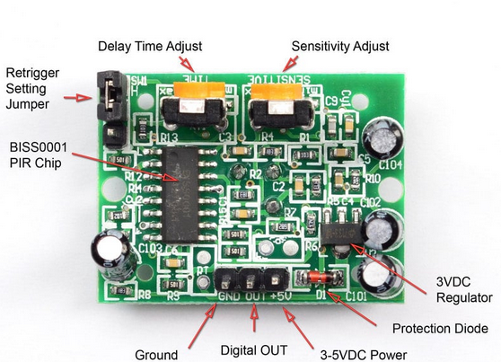

**RaspPlayVideo PIR sensor**

instalar a versão Raspberry Pi OS (64bit) 1,2Gb com desktop

instalar o fbi
Sudo apt install fbi **Blackimage para não aparecer o ambiente de trabalho quando o video estiver off**

fazer git clone do raspplayvideo
Colocar o video desejado com o nome "filme.mp4" no path "/home/pi/RaspPlayVideo/"

**HC-SR501 PIR**

Conectar o Pino OUT ao pino 26 (BCM) do RaspberryPI

**Execução automática após o boot do RaspberryPi a partir do bashrc**
nano ~/bashrc

sudo /usr/bin/fbi  -d /dev/fb0  -T 1 -noverbose -a -t 5 /home/pi/RaspPlayVideo/blackimage.jpeg &
python3 /home/pi/RaspPlayVideo/sensor_raspplayvideo.py