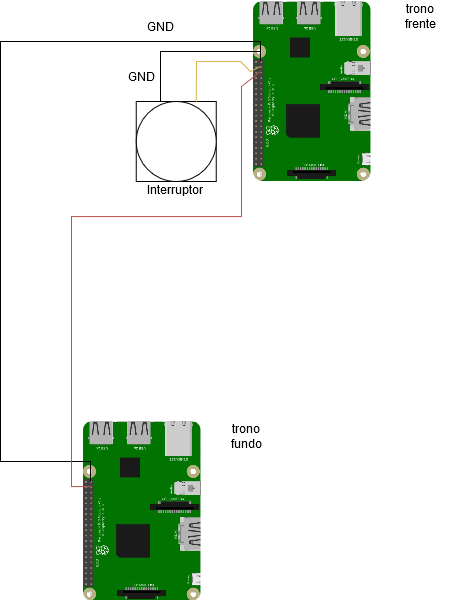

**Sistema trono**
No pp24 pretendeu-se que o cenário do trono estivesse sempre em loop e que tivesse apenas a capacidade de controlar um LED 
a partir de um interruptor. Com esse requesito, possibilitava um melhor momento para fotos, levando a preocupação dos guias
apenas com a gestão desse momento.
Desafio: Ambos os RaspberryPIs que controlaram o video dos projetores tinham que estar sincronizados, uma vez que 
tratavam do mesmo filme.

**RaspPlayVideo trono_frente**

instalar a versão Raspberry Pi OS (64bit) 1,2Gb com desktop

instalar o fbi
Sudo apt install fbi **Blackimage para não aparecer o ambiente de trabalho quando o video estiver off**

fazer git clone do raspplayvideo
Colocar o video desejado com o nome "filme.mp4" no path "/home/pi/RaspPlayVideo/"

**Implementação do sistema**

**Execução automática após o boot do RaspberryPi a partir do bashrc**
nano ~/bashrc

sudo /usr/bin/fbi  -d /dev/fb0  -T 1 -noverbose -a -t 5 /home/pi/RaspPlayVideo/blackimage.jpeg &
python3 /home/pi/RaspPlayVideo/thorne_raspplayvideo.py